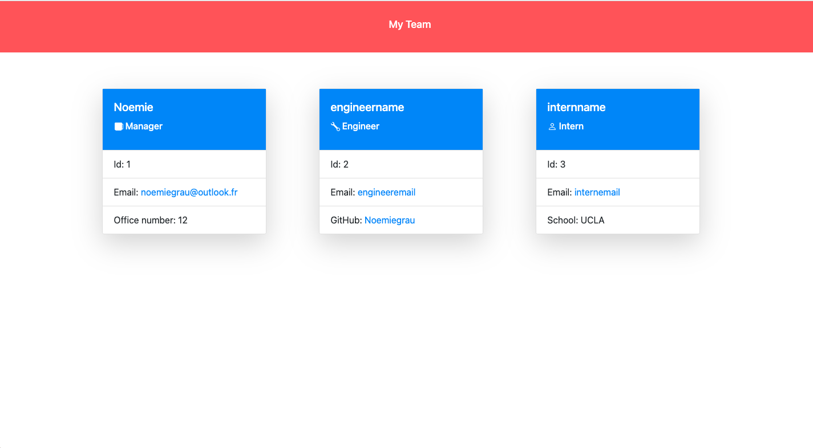

# OOP-TeamProfileGenerator

## Description

This is a Node.js command-line application that takes in information about employees on a software engineering team and then generates an HTML webpage that displays summaries for each person.

## Screenshot

## Video

https://drive.google.com/file/d/1u3XjrWHfSQDU4dpi9HQe-cA7gSHdbG-A/view